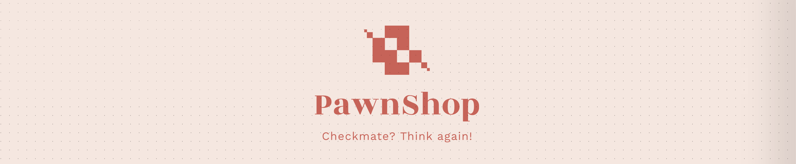

# PawnShop

A spin-off of the traditional chess, created for COS20007 - Object Oriented Programming.

## How to play

PawnShop is a creative spinoff from the original chess endgame experience, where every little mistake can have a greatly cost.

### Rules

#### Modified setup

Designed to curate a similar feel, the game starts off with an empty 8x8 board, each side with a single King.

#### Coins

The early game thus becomes the rat race as each side rushes towards coins, which are spawned randomly on the board. Only Kings can collect coin by moving into the position the coin is occupying, before the coin has time to despawn. With enough coins, a player can “pawn” a new one in any of the King’s valid movable positions. If a pawn is immediately adjacent to the King, it can also be “upgraded” to become one of the four stronger pieces with enough coins.

## Future roadmap

The game is created as a scalable, robust server to provide a prototype POC for future iteration and development. In future iterations, the author intends to migrate the core logic over to Unity to take advantage of Netcode for a multiplayer prototype.

## Built With

- [Splashkit](https://splashkit.io/) - The GUI library used

## Authors

- **Thien An Ly** - _Designer & developer_ - [thelazyant164](https://github.com/thelazyant164)
